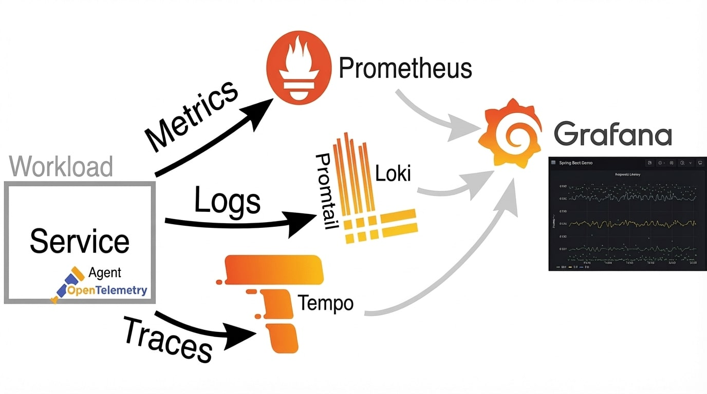

## Monitoring and Distributed Tracing with Grafana, Prometheus, Loki & Tempo




### Goal

Provide a simple **observability stack** so we can:

- **See system health** via metrics
- **Understand behaviour** via logs
- **Trace requests end-to-end** across services

This demo shows how to do that with **Prometheus, Loki, Tempo and Grafana**.

---

## Agenda

- **Why** we need observability
- **Stack overview**: Prometheus, Loki, Tempo, Grafana, etc
- **Data flow**
- **Developer workflows**: metrics, logs, traces
- **Local demo**: how to run and explore
- **Next steps** for adoption

---

## Why Observability?

- **Microservices & distributed systems** make failures harder to reason about.
- Traditional monitoring (CPU, memory, a few logs) is **not enough** to:
  - quickly understand **what** is broken
  - see **where** in a request path the problem occurs
  - correlate **metrics, logs and traces** in one place
- Goals:
  - **Faster incident response**
  - **Better debugging** in complex flows
  - **Data-driven** reliability improvements

---

## Stack Overview

- **Example services (Go, Rust, etc.)**
  - Expose HTTP **metrics endpoints** for Prometheus
  - Write **logs** to stdout
  - Emit **traces** using OpenTelemetry

- **cAdvisor**
  - Runs as a container on the host
  - Collects CPU, memory, filesystem and network metrics for each container and the host
  - Exposes these metrics on a Prometheus-compatible endpoint

- **Prometheus**
  - Scrapes metrics from the services and cAdvisor on a schedule
  - Stores time-series data and powers metric queries / alerting

- **Promtail**
  - Tails Docker container logs
  - Enriches them with labels (service, container, environment, etc.) and ships them to Loki

- **Loki**
  - Stores log streams indexed by labels instead of full-text
  - Enables fast, cost-efficient log queries in Grafana

- **Tempo**
  - Receives and stores distributed traces (spans) from the services
  - Allows querying traces by service, operation, duration, and trace ID

- **Grafana**
  - Single UI that connects to Prometheus, Loki and Tempo as datasources
  - Provides dashboards, log exploration and trace visualization
  - Makes it easy to correlate **metrics ↔ logs ↔ traces** during investigations

---

## Data Flow: Metrics

- Services expose HTTP endpoints such as `/metrics`.
- **cAdvisor** exposes container and host metrics on a Prometheus-compatible endpoint.
- **Prometheus**:
  - Scrapes service and cAdvisor endpoints on a schedule.
  - Stores metric time series (e.g. request duration, error rate, container CPU/memory).
- In **Grafana**:
  - Use Prometheus data source to build dashboards.
  - Typical visualizations:
    - Request rate (RPS)
    - Error rate (4xx/5xx)
    - Latency percentiles (p50, p95, p99)
    - Container and host resource usage (from cAdvisor)

---

## Data Flow: Logs

- Services write logs to **stdout/stderr**.
- **Docker** captures logs.
- **Promtail**:
  - Reads Docker logs.
  - Adds labels (container, service, environment).
  - Sends them to **Loki**.
- In **Grafana**:
  - Use Loki data source to query logs by label and time.
  - Filter logs by:
    - service name
    - HTTP path / status
    - correlation IDs

---

## Data Flow: Traces

- Services are **instrumented** (e.g. via OpenTelemetry) to generate spans:
  - A span typically represents a request, DB call, or external API call.
- Spans are sent to **Tempo**.
- Tempo groups spans into **traces** representing end-to-end flows.
- In **Grafana**:
  - Use Tempo data source to:
    - search traces by service/operation/duration
    - see where latency is introduced
    - identify failing segments.

---

## Example Developer Workflows

- From a **metrics** panel showing an error spike or alert:
  - Drill down into a time range with higher errors.
- Switch to **logs** (Loki) in the same time window:
  - Filter by service or status code to see detailed error messages.
- Jump into **traces** (Tempo) for a specific request:
  - Inspect the slow or failing spans.
  - Pivot back to logs from a span for deeper context.

This tight loop helps us move from **symptom → root cause** quickly.

---

## Running the Demo Locally

- Requirements:
  - Docker
  - Docker Compose

- Start the whole stack:

```bash
docker-compose up -d
```

- Access **Grafana**:
  - URL: http://localhost:13000
  - Login: `admin` / `admin` (or as configured)
  - Data sources:
    - Prometheus (metrics)
    - Loki (logs)
    - Tempo (traces)

From here you can open dashboards, run ad‑hoc queries, and explore traces.

---

## Next Steps

- Create a dashboard that contains more useful metrics and alerts based on your needs (https://grafana.com/grafana/dashboards/).
- Link more advanced metrics to traces (https://www.youtube.com/watch?v=TkapvLeMMpc).
- Zero-code instrumentation with OpenTelemetry auto-instrumentation libraries (https://opentelemetry.io/docs/zero-code/).
- Apply this stack to kubernetes.


